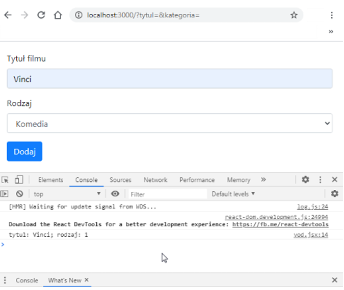

# EGZAMIN ZAWODOWY — INF.04 (INF.04-03-23.06-SG)

## Informacje ogólne

- **Czas trwania sprawdzinu:** 45 minut

---

## Część II. Aplikacja Web

Wykonaj aplikację internetową typu front-end obsługującą formularz z zastosowaniem dostępnego na stanowisku egzaminacyjnym frameworka Angular lub biblioteki React. Zastosuj bibliotekę Bootstrap do zdefiniowania stylu formularza.

---

### Obraz referency



**Obraz 1b. Formularz wykonany z biblioteką React.js. Wybrano przycisk Dodaj**

Na obrazach 1a i 1b przedstawiono działanie formularza przygotowanego w środowisku Angular i React.js po wybraniu przycisku Dodaj. W konsoli widoczne wyświetlenie danych wprowadzonych do formularza.

---

### Założenia aplikacji

- Aplikacja składa się z jednego komponentu formularza.
- Formularz składa się z:
  - pola edycyjnego i jego etykiety o treści „Tytuł filmu"
  - listy rozwijalnej i jej etykiety o treści „Rodzaj"
  - przycisku „Dodaj"
- Lista rozwijalna ma 5 opcji:
  - pustą
  - Komedia o wartości 1
  - Obyczajowy o wartości 2
  - Sensacyjny o wartości 3
  - Horror o wartości 4
- Aplikacja w stanie początkowym wyświetla puste pola formularza
- Po wybraniu przycisku „Dodaj" jest generowane zdarzenie, które ma za zadanie wypisanie danych z formularza w konsoli przeglądarki (w miejscu trzech kropek wartości pól formularza):
  - w Angular postaci: {tytul: "...", kategoria: "..."} – obraz 1a
  - w React.js postaci: tytul: ...; rodzaj: ... – obraz 1b
- Strona jest formatowana stylem: body { padding: 20px; }
- Elementy formularza są formatowane stylami biblioteki Bootstrap. Szablon HTML formularza należy zbudować sugerując się pomocą zamieszczoną w Tabeli 1. Należy zastosować znaczące nazwy dla identyfikatorów pól formularza
- Aplikacja powinna być zapisana czytelnie, z zachowaniem zasad czystego formatowania kodu, należy stosować znaczące nazwy zmiennych i funkcji.
- Dokumentacja do programu wykonana zgodnie z wytycznymi z części III zadania egzaminacyjnego. Kod aplikacji przygotuj do nagrania na płytę. W podfolderze web powinno znaleźć się archiwum całego projektu o nazwie web.zip oraz pliki z kodem źródłowym które były modyfikowane w czasie egzaminu.

---

## Część III. Dokumentacja utworzonych aplikacji

### Dokumentacja kodu

W kodzie źródłowym aplikacji konsolowej utwórz nagłówek klasy według **Listingu 1**. Nagłówek powinien znaleźć się w kodzie źródłowym nad klasą.

**UWAGA:** Dokumentację umieścić w komentarzu (wieloliniowym lub kilku jednoliniowych). Wzór dokumentacji jest bez znaków początku i końca komentarza, gdyż te są różne dla różnych języków programowania.

**Listing 1. Wzór dokumentacji klasy:**

```
****************************************************** 
nazwa klasy: <tu wstaw nazwę klasy> 
pola: <nazwa pola> - <co przechowuje> 
<nazwa pola> - <co przechowuje> 
metody: <nazwa metody>, <co zwraca> – <opis> 
informacje: <opis> 
autor: <numer zdającego> 
******************************************************
```

### Zrzuty ekranu

Wykonaj zrzuty ekranu dokumentujące uruchomienie aplikacji. Zrzuty powinny obejmować cały obszar ekranu monitora z widocznym paskiem zadań.

**Wymagane zrzuty ekranu:**

- dowolna liczba zrzutów z aplikacji konsolowej: `konsola1`, `konsola2` itd.
- dowolna liczba zrzutów z aplikacji webowej: `web1`, `web2` itd.

### Dokument egzaminacyjny

W edytorze tekstu utwórz plik `egzamin` zawierający:

- podpisane zrzuty ekranu
- nazwę systemu operacyjnego
- nazwy środowisk programistycznych użytych na egzaminie
- nazwy języków programowania/frameworków/bibliotek
- opcjonalnie komentarz do wykonanej pracy

---

## Tabela 1. Wybrane elementy frameworka Angular, biblioteki React.js i biblioteki Bootstrap

### Angular

```javascript
// To use ngModel and ngForm add:
import { FormsModule } from '@angular/forms';
// in app.module.ts file. Add FormsModule to imports table

// To use Bootstrap add to styles.css:
@import "~bootstrap/dist/css/bootstrap.css";
```

### React.js

```javascript
// To use Bootstrap add:
import 'bootstrap/dist/css/bootstrap.css';
```

### Bootstrap Forms

```html
<form> 
  <div class="form-group">
    <label for="exampleInputEmail1">Email address</label> 
    <input type="email" class="form-control" id="exampleInputEmail1" />
  </div> 
  <div class="form-group">
    ... 
  </div> 
</form>
```

**Important!** In React render method use `className` instead of `class`; `htmlFor` instead of `for`.

### Bootstrap Buttons

```html
<button type="button" class="btn btn-success">Success</button>
```

---

**Czas przeznaczony na wykonanie zadania:** 180 minut

**Ocenie będą podlegać 4 rezultaty:**

- implementacja, kompilacja, uruchomienie programu
- aplikacja konsolowa
- aplikacja web
- dokumentacja aplikacji
