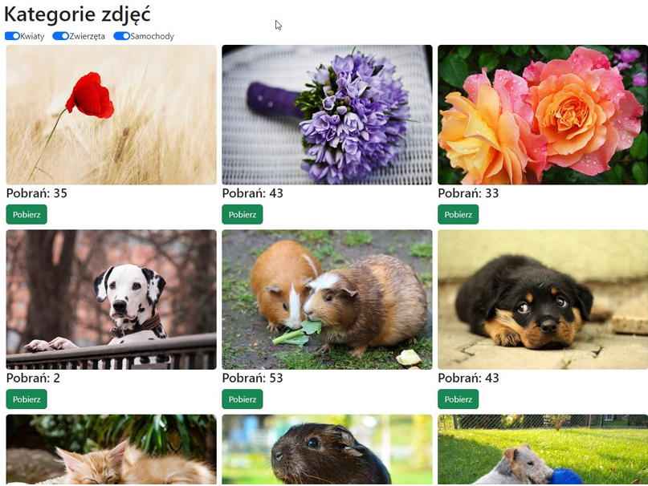
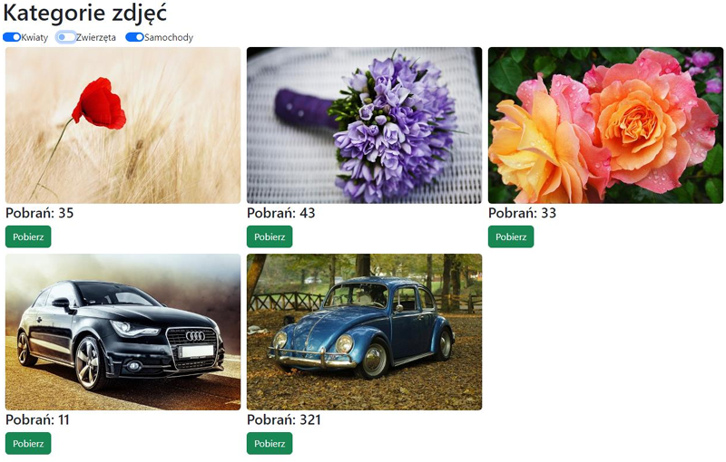
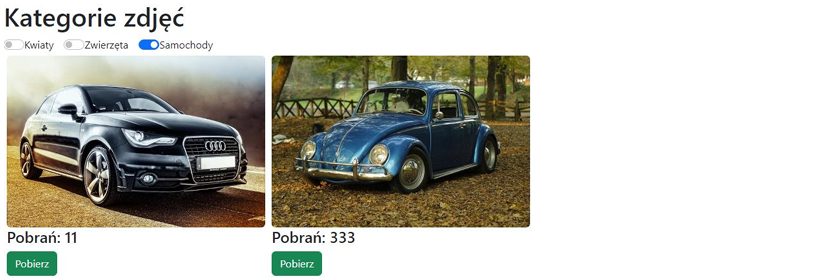

# EGZAMIN ZAWODOWY — INF.04 (INF.04-01-25.01-SG)

## Informacje ogólne

- **Czas trwania sprawdzinu:** 45 minut

---

## Część II. Aplikacja webowa

Z zastosowaniem dostępnego na stanowisku egzaminacyjnym frameworka Angular lub biblioteki React.js wykonaj aplikację internetową typu front-end realizującą funkcję kategoryzacji zdjęć w galerii. Na obrazach 2, 3, 4 przedstawiono działanie aplikacji. W zależności od zastosowanego narzędzia wygląd aplikacji może nieznacznie się różnić. Na pulpicie znajduje się archiwum, z materiałami do wykonania zadania, o nazwie pliki3.zip zabezpieczone hasłem: K@tegorie)

---

### Obrazy referencyjne

**Obraz 2. Stan początkowy aplikacji**


**Obraz 3. Aplikacja z wyłączonymi kategoriami**


**Obraz 4. Aplikacja z wybraną jedną kategorią**


Na obrazach 2, 3 i 4 przedstawiono działanie aplikacji galerii zdjęć w różnych stanach filtrowania kategorii.

---

### Założenia aplikacji

- Aplikacja składa się z jednego komponentu, którego widok w stanie początkowym zaprezentowany jest na obrazie 2 (zdjęcia mogą być wyświetlane w dowolnej kolejności)
- Do utworzenia aplikacji należy wykorzystać zdjęcia oraz plik dane.txt wypakowane z archiwum
- Obrazy należy umieścić w folderze assets (egzamin/src/assets lub egzamin/public/assets)
- Dokument dane.txt zawiera listę obiektów zdjęć, którą należy skopiować jako elementy tablicy. Każdy obiekt zdjęcia zawiera pola:
  - id
  - alt (tekst alternatywny dla zdjęcia)
  - filename (nazwa pliku ze zdjęciem)
  - category (1 dla kategorii kwiaty, 2 zwierzęta, 3 samochody)
  - downloads (liczba pobrań zdjęcia)
- Komponent składa się z:
  - Nagłówka pierwszego stopnia o treści: „Kategorie zdjęć"
  - Trzech pól switch (checkbox) domyślnie włączonych, o etykietach: Kwiaty, Zwierzęta, Samochody
  - Bloków zdjęć, które są wyświetlane warunkowo, w zależności od ustawień pól switch. Bloki są wyświetlone jeden obok drugiego, zawierają zdjęcie, nagłówek 4 stopnia z liczbą pobrań oraz przycisk o treści „Pobierz". Układ elementów jest przedstawiony na obrazie 2
- Zdjęcia są formatowane stylem: marginesy zewnętrzne 5 px, zaokrąglone rogi
- Przyciski oraz pola switch są stylowane zgodnie z przykładami w tabeli 1
- W stanie początkowym włączone są wszystkie pola switch co powoduje wyświetlenie wszystkich zdjęć
- Wyświetlane są tylko zdjęcia z kategorii dla której jest włączone pole switch (obraz 4)
- Gdy przycisk „Pobierz" zostanie kliknięty, wzrasta o jeden liczba pobrań dla danego zdjęcia. Liczba pobrań jest zapisywana w tablicy z obiektami zdjęć, co na bieżąco powoduje wyświetlenie tej modyfikacji na ekranie (obraz 5)
- W aplikacji zastosowano pętle oraz warunki do wyświetlenia bloków zdjęć. Aplikacja jest napisana uniwersalnie i działa poprawnie też dla innej liczby zdjęć
- Aplikacja powinna być zapisana czytelnie, z zachowaniem zasad czystego formatowania kodu, należy stosować znaczące nazwy zmiennych i funkcji.

Podejmij próbę uruchomienia aplikacji w przeglądarce. Informacje dotyczące zrzutów ekranu znajdują się w części III zadania egzaminacyjnego.

Kod aplikacji przygotuj do nagrania na płytę. W folderze webowa powinno znaleźć się archiwum całego folderu projektu o nazwie web.zip oraz pliki z kodem źródłowym, które były modyfikowane przez zdającego.

---

## Część III. Dokumentacja utworzonych aplikacji

### Dokumentacja kodu

W kodzie źródłowym aplikacji konsolowej umieść komentarz według **wzoru**:

```
**********************************************
nazwa metody: <nazwa> 
opis metody: <opis> 
parametry: <parametry lub „brak"> 
zwracany typ i opis: <typ> 
autor: <numer zdającego> 
**********************************************
```

### Zrzuty ekranu

Wykonaj zrzuty ekranu dokumentujące uruchomienie aplikacji. Zrzuty powinny obejmować cały obszar ekranu monitora z widocznym paskiem zadań.

**Wymagane zrzuty ekranu:**

- `konsola1`, `konsola2`, ... – aplikacja konsolowa
- `web1`, `web2`, ... – aplikacja webowa

### Dokument egzaminacyjny

W edytorze tekstu pakietu biurowego utwórz plik `egzamin` zawierający:

- podpisane zrzuty ekranu
- nazwę systemu operacyjnego
- nazwy środowisk programistycznych użytych na egzaminie
- nazwy języków programowania/frameworków/bibliotek
- opcjonalnie komentarz do wykonanej pracy

---

**Czas przeznaczony na wykonanie zadania:** 180 minut

**Ocenie będą podlegać 4 rezultaty:**

- implementacja i uruchomienie programu
- aplikacja konsolowa
- aplikacja webowa
- dokumentacja

---

## Tabela 1. Wybrane elementy biblioteki Bootstrap

### Angular

```css
@import "~bootstrap/dist/css/bootstrap.css";
```

### React.js

```javascript
import 'bootstrap/dist/css/bootstrap.css';
```

### Bootstrap Switch

```html
<div class="form-check form-switch"> 
  <input class="form-check-input" type="checkbox" id="ctrId"> 
  <label class="form-check-label" for="ctrId">My label</label> 
</div>
```

**Important!** In React render method use `className` instead of `class`; `htmlFor` instead of `for`.

### Bootstrap Buttons

```html
<button type="button" class="btn btn-success">Success</button>
```
