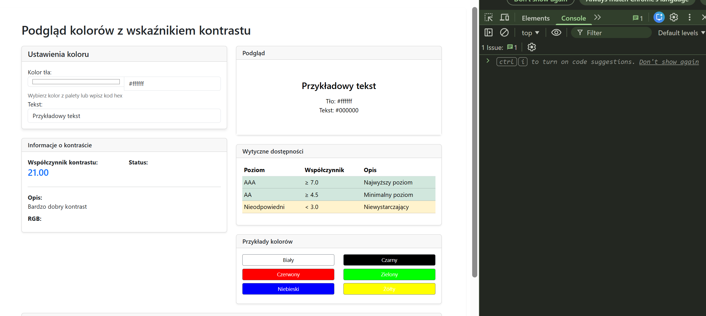
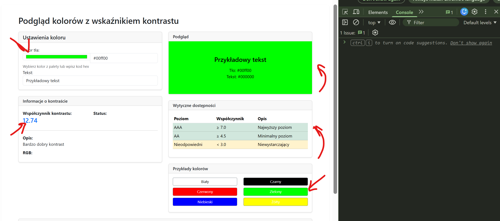

# EGZAMIN ZAWODOWY — INF.04 (INF.04-COLOR-PREVIEW-CONTRAST)

## Informacje ogólne

- **Czas trwania sprawdzinu:** 45 minut

---

## Część II. Aplikacja Web

Wykonaj aplikację internetową typu front-end obsługującą podgląd kolorów z wskaźnikiem kontrastu z zastosowaniem dostępnego na stanowisku egzaminacyjnym frameworka Angular lub biblioteki React. Zastosuj bibliotekę Bootstrap do zdefiniowania stylu aplikacji.

---

### Założenia aplikacji

- Aplikacja składa się z jednego komponentu.
- Danymi komponentu są: kolor tła (hex), tekst do wyświetlenia, wskaźnik kontrastu. Dla uproszczenia dane mogą być zdefiniowane jako stan komponentu. Należy założyć, że struktura danych w przyszłości może się zmienić, co będzie miało wpływ na zachowanie i wygląd aplikacji.
- Komponent wyświetla:
  - Nagłówek drugiego stopnia o treści: „Podgląd kolorów z wskaźnikiem kontrastu"
  - Formularz z polami: **Kolor tła** (hex) i **Tekst**
  - Podgląd karty z wybranym kolorem tła i tekstem
  - Wskaźnik kontrastu z oceną czytelności
  - Informacje o kontraście i dostępności
- Aplikacja w stanie początkowym wyświetla domyślny kolor tła (#ffffff) i przykładowy tekst
- Elementy interfejsu są formatowane zgodnie z obrazem 1b za pomocą stylów biblioteki Bootstrap. Do budowy szablonu HTML należy wykorzystać pomoc zamieszczoną w Tabeli 1. Należy zastosować znaczące nazwy dla identyfikatorów elementów
- Po zmianie koloru tła jest generowane zdarzenie, które:
  - Aktualizuje kolor tła w podglądzie
  - Przelicza kontrast względny między tłem a tekstem
  - Wyświetla wskaźnik kontrastu (OK/Niski kontrast)
  - Wyświetla w konsoli przeglądarki komunikat w formacie: `"Kontrast: {wartość} - {status}"` gdzie wartość to liczba kontrastu, status to "OK" lub "Niski kontrast"
- Po zmianie tekstu jest generowane zdarzenie, które:
  - Aktualizuje tekst w podglądzie
  - Przelicza kontrast względny
  - Aktualizuje wskaźnik kontrastu
- Kontrast względny jest obliczany według wzoru: `L = 0.299*R + 0.587*G + 0.114*B` gdzie R, G, B to wartości składowych koloru
- Wskaźnik kontrastu pokazuje "OK" gdy kontrast jest wystarczający, "Niski kontrast" gdy jest niewystarczający
- Aplikacja powinna być zapisana czytelnie, z zachowaniem zasad czystego formatowania kodu, należy stosować znaczące nazwy zmiennych i funkcji
- Dokumentacja do programu wykonana zgodnie z wytycznymi z części III zadania egzaminacyjnego. Kod aplikacji przygotuj do nagrania na płytę. W podfolderze web powinno znaleźć się archiwum całego projektu o nazwie web.zip oraz pliki z kodem źródłowym, które były modyfikowane.

---

### Przykłady działania aplikacji

Proszę zbadać działanie aplikacji na podstawie zrzutów ekranu. Jeśli jakaś część zadania nie jest zrozumiała, proszę budować rozwiązanie zgodnie z przykładami przedstawionymi w rozdziale Przykłady działania aplikacji.


**Obraz 1. Przykład działania aplikacji**


**Obraz 2. Przykład działania aplikacji**

---

## Część III. Testy utworzonych aplikacji

Wykonaj testy aplikacji konsolowej oraz dokumentację do aplikacji utworzonych na egzaminie.

W podfolderze konsola w programie głównym aplikacji konsolowej należy sprawdzić działanie klasy poprzez, kolejno:

- Wyświetlenie komunikatu „Liczba zarejestrowanych osób to ", gdzie jest wartością pobraną z pola statycznego klasy.
- Utworzenie obiektu za pomocą konstruktora bezparametrowego.
- Utworzenie obiektu za pomocą konstruktora z dwoma parametrami. Dane obiektu wprowadzane z klawiatury.
- Utworzenie obiektu za pomocą konstruktora kopiującego (w Python konstruktora bezparametrowego i metody kopiującej). Obiekt z wypełnionymi polami jest źródłem kopiowania danych.
- Wywołanie metody do wypisania imienia z parametrem wejściowym równym „Jan" dla wszystkich utworzonych obiektów.
- Ponowne wyświetlenie komunikatu „Liczba zarejestrowanych osób to ", gdzie jest wartością pobraną z pola statycznego klasy

Wykonaj zrzuty ekranu dokumentujące uruchomienie aplikacji utworzonych podczas egzaminu. Zrzuty powinny obejmować cały obszar ekranu monitora z widocznym paskiem zadań. Jeżeli aplikacja uruchamia się, na zrzucie należy umieścić okno z wynikiem działania programu oraz otwarte środowisko programistyczne z projektem lub okno terminala z kompilacją projektu. Jeżeli aplikacja nie uruchamia się z powodu błędów kompilacji, należy na zrzucie umieścić okno ze spisem błędów i widocznym otwartym środowiskiem programistycznym. Wykonać należy tyle zrzutów ile interakcji podejmuje aplikacja.

**Wymagane zrzuty ekranu:**
- Aplikacja konsolowa – dowolna liczba zrzutów nazwanych konsola1, konsola2 ...
- Aplikacja web – dowolna liczba zrzutów nazwanych web1, web2 ... (np. stan początkowy, po wybraniu koloru tła, po wprowadzeniu tekstu, po zmianie na kolor o niskim kontraście, stan konsoli przeglądarki z wyświetlonymi komunikatami)

W edytorze tekstu pakietu biurowego utwórz plik z dokumentacją i nazwij go egzamin. Dokument powinien zawierać informacje:

- Nazwę systemu operacyjnego, na którym pracował zdający
- Nazwy środowisk programistycznych, z których zdający korzystał na egzaminie
- Nazwy języków programowania / frameworków / bibliotek użytych podczas tworzenia aplikacji

Zrzuty ekranu i dokument umieść w folderze o nazwie testy.

**UWAGA:** Nagraj płytę z rezultatami pracy. W folderze z numerem zdającego powinny się znajdować podfoldery: konsola, testy, web. W folderze konsola: spakowany cały projekt aplikacji konsolowej, pliki z kodem źródłowym, opcjonalnie plik uruchomieniowy. W folderze testy: pliki ze zrzutami oraz plik egzamin. W folderze web: spakowany cały projekt aplikacji web, pliki modyfikowane przez zdającego. Po nagraniu płyty sprawdź poprawność nagrania. Opisz płytę swoim numerem i pozostaw na stanowisku, zapakowaną w pudełku wraz z arkuszem egzaminacyjnym.

**Czas przeznaczony na wykonanie zadania:** 180 minut

**Ocenie będą podlegać 4 rezultaty:**
- implementacja, kompilacja, uruchomienie programu
- aplikacja konsolowa
- aplikacja web
- testy aplikacji

---

## Tabela 1. Wybrane elementy frameworka Angular, biblioteki React.js i biblioteki Bootstrap - przykłady

### Angular

To use ngModel i ngForm add: import { FormsModule } from '@angular/forms'; in app.module.ts file. Add FormsModule to imports table

To use Bootstrap add to styles.css: @import "~bootstrap/dist/css/bootstrap.css";

### React.js

To use Bootstrap add: import 'bootstrap/dist/css/bootstrap.css';

### Bootstrap Forms

(Źródło https://getbootstrap.com/docs/4.0/components/forms/)

Be sure to use an appropriate type attribute on all inputs (e.g., email for email address or number for numerical information) to take advantage of newer input controls like email verification, number selection, and more.

Textual form controls—like inputs, selects, and textareas—are styled with the .form-control class. Included are styles for general appearance, focus state, sizing, and more.

```html
<form> 
  <div class="form-group"> 
    <label for="exampleInputEmail1">Email address</label> 
    <input type="email" class="form-control" id="exampleInputEmail1" /> 
  </div> 
  <div class="form-group">   
    <label for="exampleText">Text</label>
    <input type="text" class="form-control" id="exampleText" />
  </div>
</form>
```

**Important!** In React render method use className instead of class; htmlFor instead of for.

### Bootstrap Color Input

(Źródło https://getbootstrap.com/docs/4.0/components/forms/)

Color inputs are a special type of input that allows users to select a color from a color picker interface.

```html
<input type="color" class="form-control" id="colorInput" value="#563d7c">
```

### Bootstrap Cards

(Źródło https://getbootstrap.com/docs/4.0/components/card/)

A card is a flexible and extensible content container. It includes options for headers and footers, a wide variety of content, contextual background colors, and powerful display options.

```html
<div class="card" style="width: 18rem;">
  <div class="card-header">
    Featured
  </div>
  <div class="card-body">
    <h5 class="card-title">Special title treatment</h5>
    <p class="card-text">With supporting text below as a natural lead-in to additional content.</p>
    <button class="btn btn-primary">Go somewhere</button>
  </div>
</div>
```

### Bootstrap Badges

(Źródło https://getbootstrap.com/docs/4.0/components/badge/)

Badges are small and simple components for displaying an indicator or count. They're commonly used in email clients like Outlook, or messaging clients like Slack for displaying unread message counts.

```html
<span class="badge badge-primary">Primary</span>
<span class="badge badge-secondary">Secondary</span>
<span class="badge badge-success">Success</span>
<span class="badge badge-danger">Danger</span>
<span class="badge badge-warning">Warning</span>
<span class="badge badge-info">Info</span>
<span class="badge badge-light">Light</span>
<span class="badge badge-dark">Dark</span>
```

### Bootstrap Alerts

(Źródło https://getbootstrap.com/docs/4.0/components/alerts/)

Alerts are available for any length of text, as well as an optional dismiss button. For proper styling, use one of the eight required contextual classes (e.g., .alert-success). For inline dismissal, use the alerts JavaScript plugin.

```html
<div class="alert alert-primary" role="alert">
  This is a primary alert—check it out!
</div>
<div class="alert alert-secondary" role="alert">
  This is a secondary alert—check it out!
</div>
<div class="alert alert-success" role="alert">
  This is a success alert—check it out!
</div>
<div class="alert alert-danger" role="alert">
  This is a danger alert—check it out!
</div>
<div class="alert alert-warning" role="alert">
  This is a warning alert—check it out!
</div>
<div class="alert alert-info" role="alert">
  This is an info alert—check it out!
</div>
<div class="alert alert-light" role="alert">
  This is a light alert—check it out!
</div>
<div class="alert alert-dark" role="alert">
  This is a dark alert—check it out!
</div>
```

### Bootstrap Buttons

(Źródło https://getbootstrap.com/docs/4.0/components/buttons/)

Bootstrap includes several predefined button styles, each serving its own semantic purpose, with a few extras thrown in for more control. The btn classes are designed to be used with the `<button>` element. Add modifier classes as: btn-primary, btn-secondary, btn-success and more to btn class in order to add background colors.

e.g. `<button type="button" class="btn btn-success">Success</button>`
