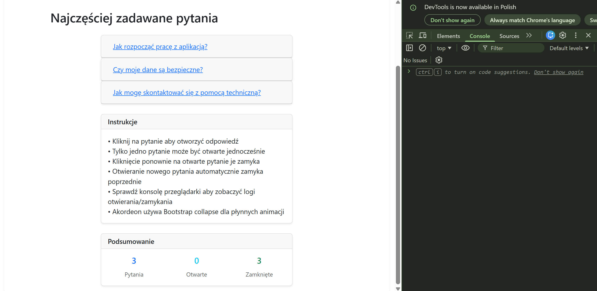
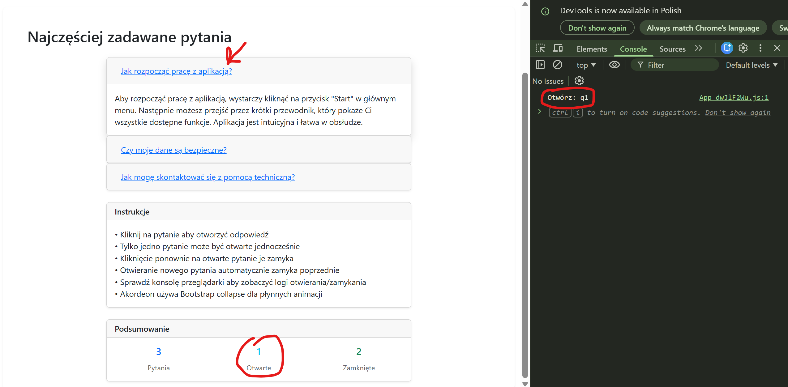
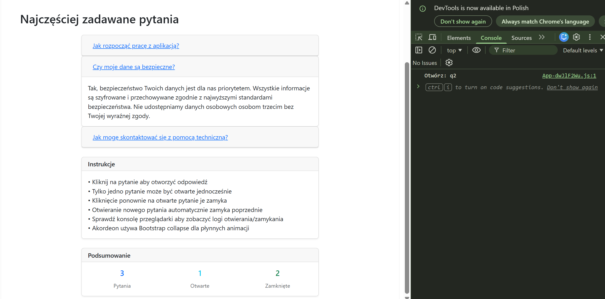

# EGZAMIN ZAWODOWY — INF.04 (INF.04-FAQ-ACCORDION)

## Informacje ogólne

- **Czas trwania sprawdzinu:** 45 minut

---

## Część II. Aplikacja Web

Wykonaj aplikację internetową typu front-end obsługującą akordeon z pytaniami i odpowiedziami z zastosowaniem dostępnego na stanowisku egzaminacyjnym frameworka Angular lub biblioteki React. Zastosuj bibliotekę Bootstrap do zdefiniowania stylu aplikacji.

---

### Założenia aplikacji

- Aplikacja składa się z jednego komponentu.
- Danymi komponentu jest tablica z pytaniami i odpowiedziami zawierająca trzy elementy o strukturze: `{ id, title, content }`. Dla uproszczenia tablica może być zdefiniowana jako pole komponentu. Należy założyć, że tablica w przyszłości może się zmienić, co będzie miało wpływ na zachowanie i wygląd aplikacji.
- Komponent wyświetla:
  - Nagłówek drugiego stopnia o treści: „Najczęściej zadawane pytania"
  - Akordeon składający się z trzech paneli, gdzie każdy panel zawiera:
    - Nagłówek z pytaniem (klikalny)
    - Treść z odpowiedzią (widoczna tylko gdy panel jest otwarty)
- Aplikacja w stanie początkowym wyświetla wszystkie panele zamknięte
- Elementy interfejsu są formatowane zgodnie z obrazem 1b za pomocą stylów biblioteki Bootstrap. Do budowy szablonu HTML należy wykorzystać pomoc zamieszczoną w Tabeli 1. Należy zastosować znaczące nazwy dla identyfikatorów elementów
- Po kliknięciu na nagłówek pytania jest generowane zdarzenie, które:
  - Jeśli panel jest zamknięty: otwiera go i zamyka wszystkie inne panele
  - Jeśli panel jest otwarty: zamyka go
  - Wyświetla w konsoli przeglądarki komunikat "Otwórz: {id}" gdy panel się otwiera lub "Zamknij: {id}" gdy panel się zamyka
- W każdym momencie może być otwarty tylko jeden panel akordeonu
- Aplikacja powinna być zapisana czytelnie, z zachowaniem zasad czystego formatowania kodu, należy stosować znaczące nazwy zmiennych i funkcji
- Dokumentacja do programu wykonana zgodnie z wytycznymi z części III zadania egzaminacyjnego. Kod aplikacji przygotuj do nagrania na płytę. W podfolderze web powinno znaleźć się archiwum całego projektu o nazwie web.zip oraz pliki z kodem źródłowym, które były modyfikowane.

---

### Przykłady działania aplikacji

Proszę zbadać działanie aplikacji na podstawie zrzutów ekranu. Jeśli jakaś część zadania nie jest zrozumiała, proszę budować rozwiązanie zgodnie z przykładami przedstawionymi w rozdziale Przykłady działania aplikacji.


**Obraz 1. Przykład działania aplikacji**


**Obraz 2. Przykład działania aplikacji**


**Obraz 3. Przykład działania aplikacji**

---

## Część III. Testy utworzonych aplikacji

Wykonaj testy aplikacji konsolowej oraz dokumentację do aplikacji utworzonych na egzaminie.

W podfolderze konsola w programie głównym aplikacji konsolowej należy sprawdzić działanie klasy poprzez, kolejno:

- Wyświetlenie komunikatu „Liczba zarejestrowanych osób to ", gdzie jest wartością pobraną z pola statycznego klasy.
- Utworzenie obiektu za pomocą konstruktora bezparametrowego.
- Utworzenie obiektu za pomocą konstruktora z dwoma parametrami. Dane obiektu wprowadzane z klawiatury.
- Utworzenie obiektu za pomocą konstruktora kopiującego (w Python konstruktora bezparametrowego i metody kopiującej). Obiekt z wypełnionymi polami jest źródłem kopiowania danych.
- Wywołanie metody do wypisania imienia z parametrem wejściowym równym „Jan" dla wszystkich utworzonych obiektów.
- Ponowne wyświetlenie komunikatu „Liczba zarejestrowanych osób to ", gdzie jest wartością pobraną z pola statycznego klasy

Wykonaj zrzuty ekranu dokumentujące uruchomienie aplikacji utworzonych podczas egzaminu. Zrzuty powinny obejmować cały obszar ekranu monitora z widocznym paskiem zadań. Jeżeli aplikacja uruchamia się, na zrzucie należy umieścić okno z wynikiem działania programu oraz otwarte środowisko programistyczne z projektem lub okno terminala z kompilacją projektu. Jeżeli aplikacja nie uruchamia się z powodu błędów kompilacji, należy na zrzucie umieścić okno ze spisem błędów i widocznym otwartym środowiskiem programistycznym. Wykonać należy tyle zrzutów ile interakcji podejmuje aplikacja.

**Wymagane zrzuty ekranu:**
- Aplikacja konsolowa – dowolna liczba zrzutów nazwanych konsola1, konsola2 ...
- Aplikacja web – dowolna liczba zrzutów nazwanych web1, web2 ... (np. stan początkowy z zamkniętymi panelami, po kliknięciu pierwszego pytania, po kliknięciu drugiego pytania, po kliknięciu tego samego pytania ponownie, stan konsoli przeglądarki z wyświetlonymi komunikatami)

W edytorze tekstu pakietu biurowego utwórz plik z dokumentacją i nazwij go egzamin. Dokument powinien zawierać informacje:

- Nazwę systemu operacyjnego, na którym pracował zdający
- Nazwy środowisk programistycznych, z których zdający korzystał na egzaminie
- Nazwy języków programowania / frameworków / bibliotek użytych podczas tworzenia aplikacji

Zrzuty ekranu i dokument umieść w folderze o nazwie testy.

**UWAGA:** Nagraj płytę z rezultatami pracy. W folderze z numerem zdającego powinny się znajdować podfoldery: konsola, testy, web. W folderze konsola: spakowany cały projekt aplikacji konsolowej, pliki z kodem źródłowym, opcjonalnie plik uruchomieniowy. W folderze testy: pliki ze zrzutami oraz plik egzamin. W folderze web: spakowany cały projekt aplikacji web, pliki modyfikowane przez zdającego. Po nagraniu płyty sprawdź poprawność nagrania. Opisz płytę swoim numerem i pozostaw na stanowisku, zapakowaną w pudełku wraz z arkuszem egzaminacyjnym.

**Czas przeznaczony na wykonanie zadania:** 180 minut

**Ocenie będą podlegać 4 rezultaty:**
- implementacja, kompilacja, uruchomienie programu
- aplikacja konsolowa
- aplikacja web
- testy aplikacji

---

## Tabela 1. Wybrane elementy frameworka Angular, biblioteki React.js i biblioteki Bootstrap - przykłady

### Angular

To use ngModel i ngForm add: import { FormsModule } from '@angular/forms'; in app.module.ts file. Add FormsModule to imports table

To use Bootstrap add to styles.css: @import "~bootstrap/dist/css/bootstrap.css";

### React.js

To use Bootstrap add: import 'bootstrap/dist/css/bootstrap.css';

### Bootstrap Accordion

(Źródło https://getbootstrap.com/docs/4.0/components/collapse/)

The collapse JavaScript plugin is used to show and hide content. Buttons or anchors are used as triggers that are mapped to specific elements you toggle.

```html
<div class="accordion" id="accordionExample">
  <div class="card">
    <div class="card-header" id="headingOne">
      <h5 class="mb-0">
        <button class="btn btn-link" type="button" data-toggle="collapse" data-target="#collapseOne">
          Collapsible Group Item #1
        </button>
      </h5>
    </div>
    <div id="collapseOne" class="collapse" data-parent="#accordionExample">
      <div class="card-body">
        Anim pariatur cliche reprehenderit, enim eiusmod high life accusamus terry richardson ad squid.
      </div>
    </div>
  </div>
</div>
```

### Bootstrap Cards

(Źródło https://getbootstrap.com/docs/4.0/components/card/)

A card is a flexible and extensible content container. It includes options for headers and footers, a wide variety of content, contextual background colors, and powerful display options.

```html
<div class="card" style="width: 18rem;">
  <div class="card-header">
    Featured
  </div>
  <div class="card-body">
    <h5 class="card-title">Special title treatment</h5>
    <p class="card-text">With supporting text below as a natural lead-in to additional content.</p>
    <button class="btn btn-primary">Go somewhere</button>
  </div>
</div>
```

### Bootstrap Buttons

(Źródło https://getbootstrap.com/docs/4.0/components/buttons/)

Bootstrap includes several predefined button styles, each serving its own semantic purpose, with a few extras thrown in for more control. The btn classes are designed to be used with the `<button>` element. Add modifier classes as: btn-primary, btn-secondary, btn-success and more to btn class in order to add background colors.

e.g. `<button type="button" class="btn btn-success">Success</button>`

**Important!** In React render method use className instead of class; htmlFor instead of for.
