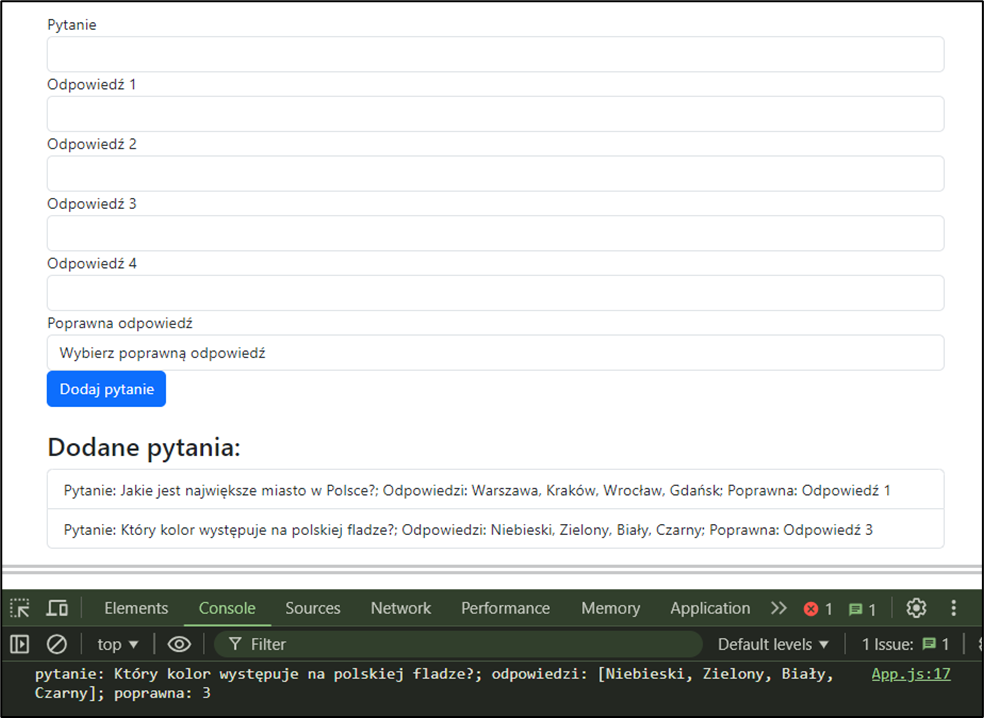

# Quiz Maker Application

## Informacje ogólne

- **Czas trwania sprawdzinu:** 45 minut

---

## Część II. Aplikacja Web

Wykonaj aplikację internetową typu front-end obsługującą tworzenie i rozwiązywanie quizów z zastosowaniem dostępnego na stanowisku egzaminacyjnym frameworka Angular lub biblioteki React. Zastosuj bibliotekę Bootstrap do zdefiniowania stylu formularza.

---

### Obraz referencyjny

**Obraz 1. Aplikacja React.js**

Na obrazie przedstawiono działanie aplikacji przygotowanej w środowisku React.js, stan po utworzeniu quizu z kilkoma pytaniami.

---

### Założenia aplikacji

- Aplikacja składa się z jednego komponentu.
- Danymi komponentu jest tablica z pytaniami, gdzie każde pytanie ma: treść pytania, opcje odpowiedzi i poprawną odpowiedź.
- Komponent wyświetla:
  - Nagłówek drugiego stopnia o treści: „Tworzenie quizów"
  - Formularz do dodawania nowych pytań składający się z:
    - pola edycyjnego i jego etykiety o treści „Treść pytania:"
    - czterech pól edycyjnych i ich etykiet o treści „Opcja A:", „Opcja B:", „Opcja C:", „Opcja D:"
    - pola wyboru i jego etykiety o treści „Poprawna odpowiedź:" z opcjami: A, B, C, D
    - przycisku „Dodaj pytanie"
  - Listę wszystkich pytań z możliwością usuwania
  - Przycisk „Rozpocznij quiz" do przejścia w tryb rozwiązywania
  - W trybie rozwiązywania: wyświetlanie pytań pojedynczo z możliwością wyboru odpowiedzi
  - Wynik quizu po zakończeniu
- Aplikacja w stanie początkowym wyświetla puste pola formularza
- Elementy formularza są formatowane zgodnie z obrazem za pomocą stylów biblioteki Bootstrap
- Po wybraniu przycisku formularza jest generowane zdarzenie zatwierdzenia formularza, które dodaje nowe pytanie do listy
- Każde pytanie na liście ma przycisk do usuwania
- Aplikacja powinna być zapisana czytelnie, z zachowaniem zasad czystego formatowania kodu, należy stosować znaczące nazwy zmiennych i funkcji

---

## Część III. Testy utworzonych aplikacji

Wykonaj testy aplikacji oraz dokumentację do aplikacji utworzonych na egzaminie.

**Wymagane zrzuty ekranu:**
- Aplikacja web – dowolna liczba zrzutów nazwanych web1, web2 ... (np. stan początkowy, po dodaniu pytań, podczas rozwiązywania quizu, wynik quizu)

W edytorze tekstu pakietu biurowego utwórz plik z dokumentacją i nazwij go egzamin. Dokument powinien zawierać informacje:

- Nazwę systemu operacyjnego, na którym pracował zdający
- Nazwy środowisk programistycznych, z których zdający korzystał na egzaminie
- Nazwy języków programowania / frameworków / bibliotek użytych podczas tworzenia aplikacji

Zrzuty ekranu i dokument umieść w folderze o nazwie testy.

**Czas przeznaczony na wykonanie zadania:** 180 minut

**Ocenie będą podlegać 4 rezultaty:**
- implementacja, kompilacja, uruchomienie programu
- aplikacja konsolowa
- aplikacja web
- testy aplikacji
