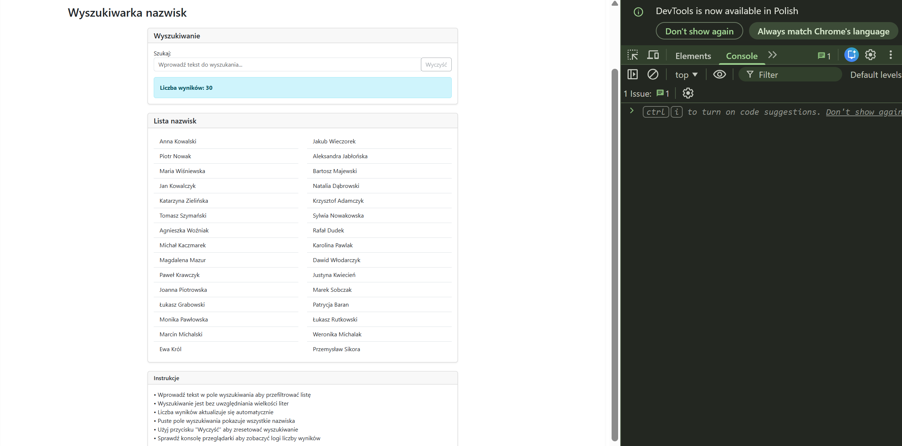
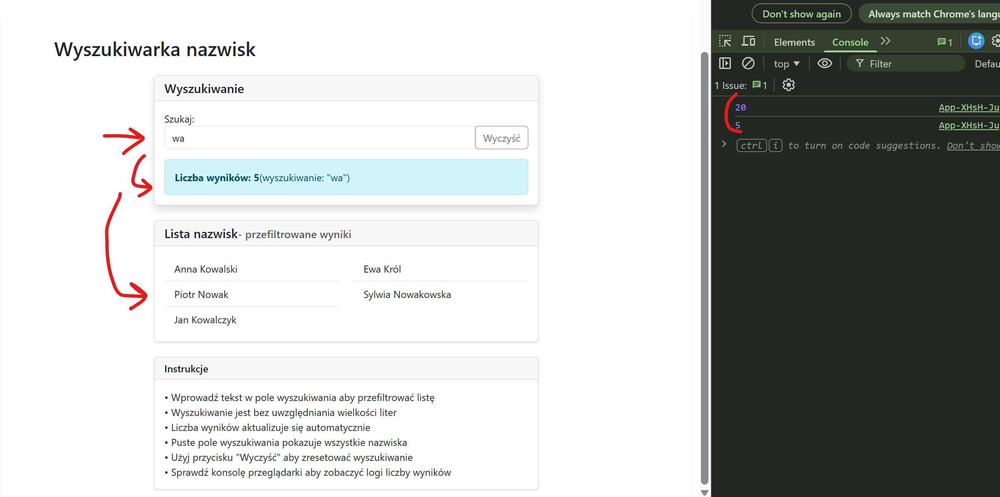

# EGZAMIN ZAWODOWY — INF.04 (INF.04-SEARCHABLE-LIST)

## Informacje ogólne

- **Czas trwania sprawdzinu:** 45 minut

---

## Część II. Aplikacja Web

Wykonaj aplikację internetową typu front-end obsługującą wyszukiwanie w liście nazwisk z zastosowaniem dostępnego na stanowisku egzaminacyjnym frameworka Angular lub biblioteki React. Zastosuj bibliotekę Bootstrap do zdefiniowania stylu aplikacji.

---

### Założenia aplikacji

- Aplikacja składa się z jednego komponentu.
- Danymi komponentu jest tablica z nazwiskami zawierająca 30 elementów. Dla uproszczenia tablica może być zdefiniowana jako pole komponentu. Należy założyć, że tablica w przyszłości może się zmienić, co będzie miało wpływ na zachowanie i wygląd aplikacji.
- Komponent wyświetla:
  - Nagłówek drugiego stopnia o treści: „Wyszukiwarka nazwisk"
  - Pole wyszukiwania z etykietą „Szukaj:" i przyciskiem „Wyczyść"
  - Wskaźnik liczby wyników o treści „Liczba wyników: N" (gdzie N to liczba znalezionych nazwisk)
  - Listę nazwisk wyświetlaną w formie numerowanej listy
- Aplikacja w stanie początkowym wyświetla puste pole wyszukiwania i wszystkie nazwiska z tablicy
- Elementy interfejsu są formatowane zgodnie z Aplikacją referencyjną za pomocą stylów biblioteki Bootstrap. Do budowy szablonu HTML należy wykorzystać pomoc zamieszczoną w Tabeli 1. Należy zastosować znaczące nazwy dla identyfikatorów elementów
- Po wprowadzeniu tekstu w pole wyszukiwania jest generowane zdarzenie, które:
  - Filtruje listę nazwisk na podstawie wprowadzonego tekstu (wyszukiwanie bez uwzględniania wielkości liter)
  - Wyświetla w konsoli przeglądarki liczbę znalezionych wyników po każdej zmianie
  - Aktualizuje wskaźnik liczby wyników
  - Wyświetla przefiltrowaną listę nazwisk
- Jeśli pole wyszukiwania jest puste, wyświetlane są wszystkie nazwiska
- Aplikacja powinna być zapisana czytelnie, z zachowaniem zasad czystego formatowania kodu, należy stosować znaczące nazwy zmiennych i funkcji
- Dokumentacja do programu wykonana zgodnie z wytycznymi z części III zadania egzaminacyjnego. Kod aplikacji przygotuj do nagrania na płytę. W podfolderze web powinno znaleźć się archiwum całego projektu o nazwie web.zip oraz pliki z kodem źródłowym, które były modyfikowane.

---

### Przykłady działania aplikacji

Proszę zbadać działanie aplikacji na podstawie zrzutów ekranu. Jeśli jakaś część zadania nie jest zrozumiała, proszę budować rozwiązanie zgodnie z przykładami przedstawionymi w rozdziale Przykłady działania aplikacji.


**Obraz 1. Przykład działania aplikacji**


**Obraz 2. Przykład działania aplikacji**

---

## Część III. Testy utworzonej aplikacji

Wykonaj testy aplikacji web oraz dokumentację do aplikacji utworzonej na egzaminie.

Wykonaj zrzuty ekranu dokumentujące uruchomienie aplikacji utworzonej podczas egzaminu. Zrzuty powinny obejmować cały obszar ekranu monitora z widocznym paskiem zadań. Jeżeli aplikacja uruchamia się, na zrzucie należy umieścić okno z wynikiem działania programu oraz otwarte środowisko programistyczne z projektem lub okno terminala z kompilacją projektu. Jeżeli aplikacja nie uruchamia się z powodu błędów kompilacji, należy na zrzucie umieścić okno ze spisem błędów i widocznym otwartym środowiskiem programistycznym. Wykonać należy tyle zrzutów ile interakcji podejmuje aplikacja.

**Wymagane zrzuty ekranu:**
- Aplikacja web – dowolna liczba zrzutów nazwanych web1, web2 ... (np. stan początkowy, po wprowadzeniu frazy "Kowalski", po wprowadzeniu frazy "Anna", po wyczyszczeniu wyszukiwania, stan konsoli przeglądarki z wyświetlonymi komunikatami)

W edytorze tekstu pakietu biurowego utwórz plik z dokumentacją i nazwij go egzamin. Dokument powinien zawierać informacje:

- Nazwę systemu operacyjnego, na którym pracował zdający
- Nazwy środowisk programistycznych, z których zdający korzystał na egzaminie
- Nazwy języków programowania / frameworków / bibliotek użytych podczas tworzenia aplikacji

Zrzuty ekranu i dokument umieść w folderze o nazwie testy.

**UWAGA:** Nagraj płytę z rezultatami pracy. W folderze z numerem zdającego powinny się znajdować podfoldery: testy, web. W folderze testy: pliki ze zrzutami oraz plik egzamin. W folderze web: spakowany cały projekt aplikacji web, pliki modyfikowane przez zdającego. Po nagraniu płyty sprawdź poprawność nagrania. Opisz płytę swoim numerem i pozostaw na stanowisku, zapakowaną w pudełku wraz z arkuszem egzaminacyjnym.

**Czas przeznaczony na wykonanie zadania:** 180 minut

**Ocenie będą podlegać 3 rezultaty:**
- implementacja, kompilacja, uruchomienie programu
- aplikacja web
- testy aplikacji

---

## Tabela 1. Wybrane elementy frameworka Angular, biblioteki React.js i biblioteki Bootstrap - przykłady

### Angular

To use ngModel i ngForm add: import { FormsModule } from '@angular/forms'; in app.module.ts file. Add FormsModule to imports table

To use Bootstrap add to styles.css: @import "~bootstrap/dist/css/bootstrap.css";

### React.js

To use Bootstrap add: import 'bootstrap/dist/css/bootstrap.css';

### Bootstrap Forms

(Źródło https://getbootstrap.com/docs/4.0/components/forms/)

Be sure to use an appropriate type attribute on all inputs (e.g., email for email address or number for numerical information) to take advantage of newer input controls like email verification, number selection, and more.

Textual form controls—like inputs, selects, and textareas—are styled with the .form-control class. Included are styles for general appearance, focus state, sizing, and more.

```html
<form> 
  <div class="form-group"> 
    <label for="exampleInputEmail1">Email address</label> 
    <input type="email" class="form-control" id="exampleInputEmail1" /> 
  </div> 
  <div class="form-group">   
    <label for="exampleSearch">Search</label>
    <input type="text" class="form-control" id="exampleSearch" placeholder="Wprowadź tekst..." />
  </div>
</form>
```

**Important!** In React render method use className instead of class; htmlFor instead of for.

### Bootstrap Lists

(Źródło https://getbootstrap.com/docs/4.0/content/typography/)

Lists are a very flexible way to display content. Bootstrap provides several list styles and utilities for styling lists.

```html
<ol class="list-group">
  <li class="list-group-item">First item</li>
  <li class="list-group-item">Second item</li>
  <li class="list-group-item">Third item</li>
</ol>
```

### Bootstrap Cards

(Źródło https://getbootstrap.com/docs/4.0/components/card/)

A card is a flexible and extensible content container. It includes options for headers and footers, a wide variety of content, contextual background colors, and powerful display options.

```html
<div class="card" style="width: 18rem;">
  <div class="card-header">
    Featured
  </div>
  <div class="card-body">
    <h5 class="card-title">Special title treatment</h5>
    <p class="card-text">With supporting text below as a natural lead-in to additional content.</p>
    <button class="btn btn-primary">Go somewhere</button>
  </div>
</div>
```

### Bootstrap Buttons

(Źródło https://getbootstrap.com/docs/4.0/components/buttons/)

Bootstrap includes several predefined button styles, each serving its own semantic purpose, with a few extras thrown in for more control. The btn classes are designed to be used with the `<button>` element. Add modifier classes as: btn-primary, btn-secondary, btn-success and more to btn class in order to add background colors.

e.g. `<button type="button" class="btn btn-success">Success</button>`
