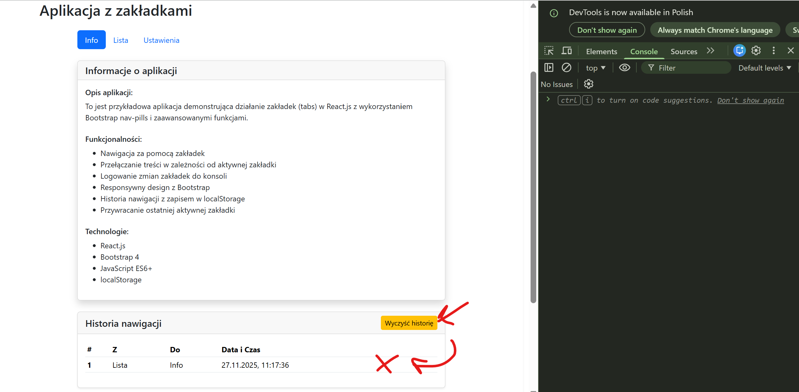
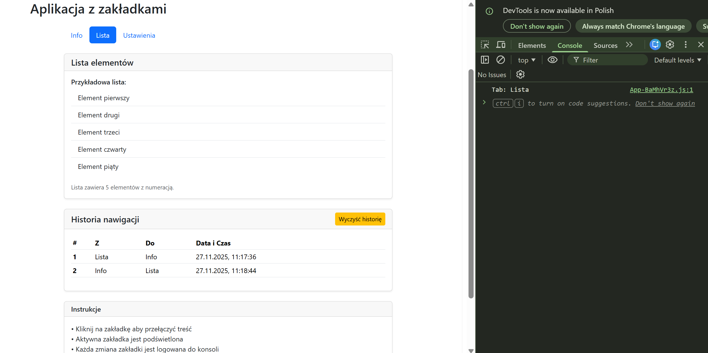
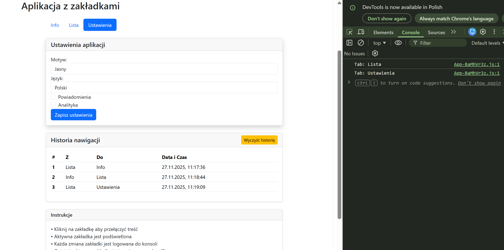

# EGZAMIN ZAWODOWY — INF.04 (INF.04-TABS-NAV-PILLS-ADVANCE)

## Informacje ogólne

- **Czas trwania sprawdzinu:** 45 minut

---

## Część II. Aplikacja Web

Wykonaj aplikację internetową typu front-end obsługującą nawigację za pomocą zakładek z zaawansowanymi funkcjami (+20% trudności) z zastosowaniem dostępnego na stanowisku egzaminacyjnym frameworka Angular lub biblioteki React. Zastosuj bibliotekę Bootstrap do zdefiniowania stylu aplikacji.

---

### Założenia aplikacji

- Aplikacja składa się z jednego komponentu.
- Danymi komponentu są trzy zakładki: "Info", "Lista", "Ustawienia" z odpowiadającymi im treściami. Dla uproszczenia dane mogą być zdefiniowane jako pola komponentu. Należy założyć, że struktura danych w przyszłości może się zmienić, co będzie miało wpływ na zachowanie i wygląd aplikacji.
- Komponent wyświetla:
  - Nagłówek drugiego stopnia o treści: „Aplikacja z zakładkami"
  - Nawigację z trzema zakładkami w stylu Bootstrap nav-pills
  - Treść odpowiadającą aktywnej zakładce
  - Historię nawigacji
- Aplikacja w stanie początkowym wyświetla pierwszą zakładkę "Info" jako aktywną
- Elementy interfejsu są formatowane zgodnie z obrazem 1b za pomocą stylów biblioteki Bootstrap. Do budowy szablonu HTML należy wykorzystać pomoc zamieszczoną w Tabeli 1. Należy zastosować znaczące nazwy dla identyfikatorów elementów
- Po kliknięciu na zakładkę jest generowane zdarzenie, które:
  - Zmienia aktywną zakładkę na wybraną
  - Wyświetla w konsoli przeglądarki komunikat w formacie: „Tab: Info", „Tab: Lista" lub „Tab: Ustawienia"
  - Aktualizuje wyświetlaną treść odpowiadającą aktywnej zakładce
- Zakładka "Info" zawiera podstawowe informacje o aplikacji
- Zakładka "Lista" zawiera przykładową listę elementów
- Zakładka "Ustawienia" zawiera formularz z podstawowymi ustawieniami

---

### Przykłady działania aplikacji

Proszę zbadać działanie aplikacji na podstawie zrzutów ekranu. Jeśli jakaś część zadania nie jest zrozumiała, proszę budować rozwiązanie zgodnie z przykładami przedstawionymi w rozdziale Przykłady działania aplikacji.


**Obraz 1. Przykład działania aplikacji**


**Obraz 2. Przykład działania aplikacji**


**Obraz 3. Przykład działania aplikacji**

---

### Funkcje zaawansowane (+20% trudności)

- **Historia nawigacji** - śledzenie wszystkich przełączeń między zakładkami z czasem
- **Persystencja danych** - zapisywanie ostatniej aktywnej zakładki w `localStorage` i przywracanie przy starcie aplikacji
- **Reset historii** - możliwość wyczyszczenia historii nawigacji

- Aplikacja powinna być zapisana czytelnie, z zachowaniem zasad czystego formatowania kodu, należy stosować znaczące nazwy zmiennych i funkcji
- Dokumentacja do programu wykonana zgodnie z wytycznymi z części III zadania egzaminacyjnego. Kod aplikacji przygotuj do nagrania na płytę. W podfolderze web powinno znaleźć się archiwum całego projektu o nazwie web.zip oraz pliki z kodem źródłowym, które były modyfikowane.

---

## Część III. Testy utworzonych aplikacji

Wykonaj testy aplikacji konsolowej oraz dokumentację do aplikacji utworzonych na egzaminie.

W podfolderze konsola w programie głównym aplikacji konsolowej należy sprawdzić działanie klasy poprzez, kolejno:

- Wyświetlenie komunikatu „Liczba zarejestrowanych osób to ", gdzie jest wartością pobraną z pola statycznego klasy.
- Utworzenie obiektu za pomocą konstruktora bezparametrowego.
- Utworzenie obiektu za pomocą konstruktora z dwoma parametrami. Dane obiektu wprowadzane z klawiatury.
- Utworzenie obiektu za pomocą konstruktora kopiującego (w Python konstruktora bezparametrowego i metody kopiującej). Obiekt z wypełnionymi polami jest źródłem kopiowania danych.
- Wywołanie metody do wypisania imienia z parametrem wejściowym równym „Jan" dla wszystkich utworzonych obiektów.
- Ponowne wyświetlenie komunikatu „Liczba zarejestrowanych osób to ", gdzie jest wartością pobraną z pola statycznego klasy

Wykonaj zrzuty ekranu dokumentujące uruchomienie aplikacji utworzonych podczas egzaminu. Zrzuty powinny obejmować cały obszar ekranu monitora z widocznym paskiem zadań. Jeżeli aplikacja uruchamia się, na zrzucie należy umieścić okno z wynikiem działania programu oraz otwarte środowisko programistyczne z projektem lub okno terminala z kompilacją projektu. Jeżeli aplikacja nie uruchamia się z powodu błędów kompilacji, należy na zrzucie umieścić okno ze spisem błędów i widocznym otwartym środowiskiem programistycznym. Wykonać należy tyle zrzutów ile interakcji podejmuje aplikacja.

**Wymagane zrzuty ekranu:**
- Aplikacja konsolowa – dowolna liczba zrzutów nazwanych konsola1, konsola2 ...
- Aplikacja web – dowolna liczba zrzutów nazwanych web1, web2 ... (np. stan początkowy z zakładką "Info", po kliknięciu zakładki "Lista", po kliknięciu zakładki "Ustawienia", stan konsoli przeglądarki z wyświetlonymi komunikatami, test funkcji zaawansowanych)

W edytorze tekstu pakietu biurowego utwórz plik z dokumentacją i nazwij go egzamin. Dokument powinien zawierać informacje:

- Nazwę systemu operacyjnego, na którym pracował zdający
- Nazwy środowisk programistycznych, z którymi zdający korzystał na egzaminie
- Nazwy języków programowania / frameworków / bibliotek użytych podczas tworzenia aplikacji

Zrzuty ekranu i dokument umieść w folderze o nazwie testy.

**UWAGA:** Nagraj płytę z rezultatami pracy. W folderze z numerem zdającego powinny się znajdować podfoldery: konsola, testy, web. W folderze konsola: spakowany cały projekt aplikacji konsolowej, pliki z kodem źródłowym, opcjonalnie plik uruchomieniowy. W folderze testy: pliki ze zrzutami oraz plik egzamin. W folderze web: spakowany cały projekt aplikacji web, pliki modyfikowane przez zdającego. Po nagraniu płyty sprawdź poprawność nagrania. Opisz płytę swoim numerem i pozostaw na stanowisku, zapakowaną w pudełku wraz z arkuszem egzaminacyjnym.

**Czas przeznaczony na wykonanie zadania:** 180 minut

**Ocenie będą podlegać 4 rezultaty:**
- implementacja, kompilacja, uruchomienie programu
- aplikacja konsolowa
- aplikacja web
- testy aplikacji

---

## Tabela 1. Wybrane elementy frameworka Angular, biblioteki React.js i biblioteki Bootstrap - przykłady

### Angular

To use ngModel i ngForm add: import { FormsModule } from '@angular/forms'; in app.module.ts file. Add FormsModule to imports table

To use Bootstrap add to styles.css: @import "~bootstrap/dist/css/bootstrap.css";

### React.js

To use Bootstrap add: import 'bootstrap/dist/css/bootstrap.css';

### Bootstrap Nav Pills

(Źródło https://getbootstrap.com/docs/4.0/components/navs/)

Take that same HTML, but use .nav-pills instead:

```html
<ul class="nav nav-pills">
  <li class="nav-item">
    <a class="nav-link active" href="#">Active</a>
  </li>
  <li class="nav-item">
    <a class="nav-link" href="#">Link</a>
  </li>
  <li class="nav-item">
    <a class="nav-link" href="#">Link</a>
  </li>
</ul>
```

### Bootstrap Cards

(Źródło https://getbootstrap.com/docs/4.0/components/card/)

A card is a flexible and extensible content container. It includes options for headers and footers, a wide variety of content, contextual background colors, and powerful display options.

```html
<div class="card" style="width: 18rem;">
  <div class="card-header">
    Featured
  </div>
  <div class="card-body">
    <h5 class="card-title">Special title treatment</h5>
    <p class="card-text">With supporting text below as a natural lead-in to additional content.</p>
    <button class="btn btn-primary">Go somewhere</button>
  </div>
</div>
```

### Bootstrap Forms

(Źródło https://getbootstrap.com/docs/4.0/components/forms/)

Be sure to use an appropriate type attribute on all inputs (e.g., email for email address or number for numerical information) to take advantage of newer input controls like email verification, number selection, and more.

Textual form controls—like inputs, selects, and textareas—are styled with the .form-control class. Included are styles for general appearance, focus state, sizing, and more.

```html
<form> 
  <div class="form-group"> 
    <label for="exampleInputEmail1">Email address</label> 
    <input type="email" class="form-control" id="exampleInputEmail1" /> 
  </div> 
  <div class="form-group">   
    <label for="exampleSelect">Select</label>
    <select class="form-control" id="exampleSelect">
      <option>1</option>
      <option>2</option>
      <option>3</option>
    </select>
  </div> 
</form>
```

**Important!** In React render method use className instead of class; htmlFor instead of for.
