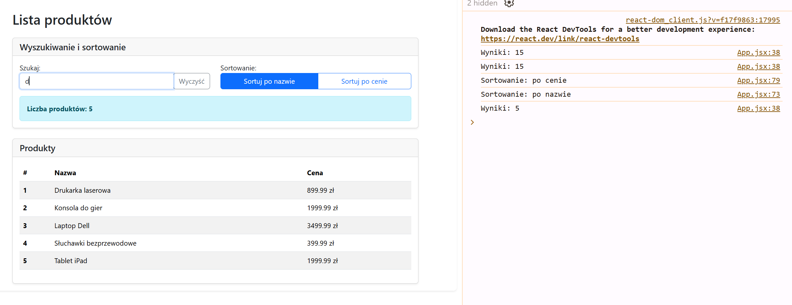
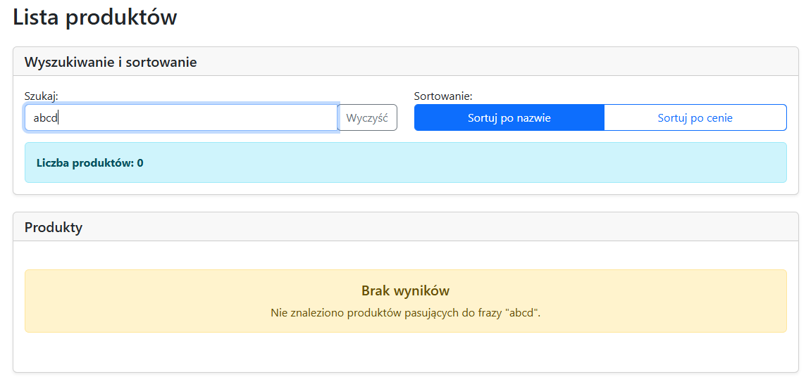

# EGZAMIN ZAWODOWY — INF.04 (PRÓBNY-2025)

## Informacje ogólne

- **Czas trwania sprawdzinu:** 90 minut

---

**Zadanie egzaminacyjne**

Katalog z aplikacją webową należy opisać, podając informacje o zdającym "web_klasa_Imie_Nazwisko". 
Wykonaj aplikację webową według wskazań.   
Utwórz aplikację webową i nazwij ją "web_klasa_Imie_Nazwisko". 

---

## Część II. Aplikacja Web

Wykonaj aplikację internetową typu front-end obsługującą listę produktów z wyszukiwaniem i sortowaniem z zastosowaniem dostępnego na stanowisku egzaminacyjnym frameworka Angular lub biblioteki React. Zastosuj bibliotekę Bootstrap do zdefiniowania stylu aplikacji.

---

### Obrazy referencyjne


**Obraz 1. Stan początkowy aplikacji**

Na obrazie 1 przedstawiono stan początkowy aplikacji: pole „Szukaj" jest puste, wyświetlana jest pełna lista 15 produktów oraz wskaźnik „Liczba produktów: 15".


**Obraz 2. Aplikacja po wpisaniu litery „d" w polu „Szukaj"**

Na obrazie 2 przedstawiono działanie wyszukiwarki po wpisaniu litery „d" w polu „Szukaj". Lista produktów została przefiltrowana (widoczne są tylko produkty zawierające literę „d" w nazwie), a wskaźnik „Liczba produktów: N" pokazuje zaktualizowaną liczbę wyników. W konsoli przeglądarki widoczne są komunikaty z liczbą wyników.


**Obraz 3. Aplikacja po wpisaniu frazy „abcd" w polu „Szukaj" — brak wyników**

Na obrazie 3 przedstawiono działanie aplikacji, gdy wyszukiwanie nie zwraca żadnych wyników. Po wpisaniu frazy „abcd" w polu „Szukaj" wskaźnik „Liczba produktów: 0" pokazuje brak znalezionych produktów. W sekcji produktów wyświetlany jest komunikat o braku wyników: nagłówek „Brak wyników" oraz opis „Nie znaleziono produktów pasujących do frazy "abcd"". Przycisk „Wyczyść" jest aktywny i umożliwia powrót do pełnej listy produktów.

---

### Założenia aplikacji

- Aplikacja składa się z jednego komponentu.
- W przypadku implementacji w React komponent powinien być komponentem funkcyjnym wykorzystującym hooki stanu (np. `useState`) oraz, opcjonalnie, efektów (np. `useEffect`). W przypadku implementacji w Angular należy zastosować pojedynczy komponent z danymi zapisanymi w polach klasy komponentu.
- Danymi komponentu jest tablica obiektów produktów zawierająca 15 elementów. Każdy produkt ma pola: `id`, `name`, `price`. Dla uproszczenia tablica może być zdefiniowana jako pole komponentu. Należy założyć, że tablica w przyszłości może się zmienić, co będzie miało wpływ na zachowanie i wygląd aplikacji.
- Komponent wyświetla:
  - Nagłówek drugiego stopnia o treści: „Lista produktów"
  - Pole wyszukiwania z etykietą „Szukaj:" i przyciskiem „Wyczyść"
  - Przyciski sortowania: „Sortuj po nazwie" i „Sortuj po cenie"
  - Wskaźnik liczby wyników o treści „Liczba produktów: N" (gdzie N to liczba znalezionych produktów)
  - Tabelę produktów z kolumnami: **Nazwa** i **Cena**
- Aplikacja w stanie początkowym wyświetla puste pole wyszukiwania i wszystkie produkty posortowane po nazwie rosnąco
- Elementy interfejsu są formatowane zgodnie z obrazami referencyjnymi za pomocą stylów biblioteki Bootstrap. Do budowy szablonu HTML należy wykorzystać pomoc zamieszczoną w Tabeli 1. Należy zastosować znaczące nazwy dla identyfikatorów elementów
- Po wprowadzeniu tekstu w pole wyszukiwania jest generowane zdarzenie, które:
  - Normalizuje wpisany tekst (np. usuwa nadmiarowe spacje, ignoruje wielkość liter).
  - Filtruje listę produktów na podstawie wprowadzonego tekstu (wyszukiwanie bez uwzględniania wielkości liter w polu `name`). Lista produktów powinna być najpierw filtrowana, a dopiero potem sortowana według aktualnie wybranego kryterium.
  - Wyświetla w konsoli przeglądarki liczbę znalezionych wyników po każdej zmianie w formacie: `Wyniki: N`, gdzie N to liczba produktów widocznych na liście po filtrowaniu.
  - Aktualizuje wskaźnik liczby wyników.
  - Wyświetla przefiltrowaną i posortowaną listę produktów.
- Po kliknięciu przycisku „Sortuj po nazwie" jest generowane zdarzenie, które:
  - Sortuje listę produktów po nazwie (rosnąco, bez uwzględniania wielkości liter)
  - Wyświetla w konsoli przeglądarki komunikat w formacie: `"Sortowanie: po nazwie"`
  - Aktualizuje wyświetlaną listę produktów
- Po kliknięciu przycisku „Sortuj po cenie" jest generowane zdarzenie, które:
  - Sortuje listę produktów po cenie (rosnąco)
  - Wyświetla w konsoli przeglądarki komunikat w formacie: `"Sortowanie: po cenie"`
  - Aktualizuje wyświetlaną listę produktów
- Jeśli pole wyszukiwania jest puste, wyświetlane są wszystkie produkty, wskaźnik liczby wyników pokazuje pełną liczbę produktów (np. „Liczba produktów: 15"), a w konsoli przeglądarki należy wypisać komunikat `Wyniki: N` z tą liczbą.
- Jeżeli po filtrowaniu nie znaleziono żadnych produktów, komponent powinien wyświetlić w interfejsie czytelny komunikat o braku wyników (np. nagłówek „Brak wyników" i krótki opis: "Nie znaleziono produktów pasujących do frazy "......"") zgodnie z obrazem 3.
- Aplikacja powinna być zapisana czytelnie, z zachowaniem zasad czystego formatowania kodu, należy stosować znaczące nazwy zmiennych i funkcji
- Dokumentacja do programu wykonana zgodnie z wytycznymi z części III zadania egzaminacyjnego. Kod aplikacji zapisz do foldera "web_klasa_Imie_Nazwisko".

---

## Część III. Testy utworzonej aplikacji

Wykonaj testy aplikacji web oraz dokumentację do aplikacji utworzonej na egzaminie.

Wykonaj zrzuty ekranu dokumentujące uruchomienie aplikacji utworzonej podczas egzaminu. Zrzuty powinny obejmować cały obszar ekranu monitora z widocznym paskiem zadań. Jeżeli aplikacja uruchamia się, na zrzucie należy umieścić okno z wynikiem działania programu oraz otwarte środowisko programistyczne z projektem. Jeżeli aplikacja nie uruchamia się z powodu błędów kompilacji, należy na zrzucie umieścić okno ze spisem błędów i widocznym otwartym środowiskiem programistycznym. Wykonać należy tyle zrzutów ile interakcji podejmuje aplikacja.

**Wymagane zrzuty ekranu:**
- Aplikacja web – dowolna liczba zrzutów nazwanych web1, web2 ... (np. stan początkowy, po wprowadzeniu frazy wyszukiwania, po kliknięciu "Sortuj po cenie", po kliknięciu "Sortuj po nazwie", po wyczyszczeniu wyszukiwania, stan konsoli przeglądarki z wyświetlonymi komunikatami)

W edytorze tekstu pakietu biurowego utwórz plik z dokumentacją i nazwij go egzamin. Dokument powinien zawierać informacje:

- Nazwę systemu operacyjnego, na którym pracował zdający
- Nazwy środowisk programistycznych, z których zdający korzystał na egzaminie
- Nazwy języków programowania / frameworków / bibliotek użytych podczas tworzenia aplikacji

Zrzuty ekranu i dokument umieść w folderze o nazwie testy.

---

## Tabela 1. Wybrane elementy frameworka Angular, biblioteki React.js i biblioteki Bootstrap - przykłady

**Tabela 1 zawiera jedynie przykładowe fragmenty kodu pokazujące użycie biblioteki Bootstrap. Zdający powinien samodzielnie zbudować strukturę komponentu i dopasować kod do wymagań zadania.**

### Angular

```javascript
// Aby użyć ngModel i ngForm dodaj:
import { FormsModule } from '@angular/forms';
// w pliku app.module.ts. Dodaj FormsModule do tablicy imports

// Aby użyć Bootstrap dodaj do styles.css:
@import "~bootstrap/dist/css/bootstrap.css";
```

### React.js

```javascript
// Aby użyć Bootstrap dodaj:
import 'bootstrap/dist/css/bootstrap.css';
```

### Bootstrap Forms

Należy użyć odpowiedniego atrybutu type dla wszystkich pól wejściowych (np. email dla adresu e-mail lub number dla informacji numerycznych), aby wykorzystać nowsze kontrolki wejściowe, takie jak weryfikacja e-maila, wybór liczby i inne.

Kontrolki formularza tekstowego — takie jak inputy, selecty i textarea — są stylowane za pomocą klasy .form-control. Zawiera style dla ogólnego wyglądu, stanu fokusa, rozmiaru i innych.

```html
<div className="form-group"> 
  <label htmlFor="exampleInput">Etykieta</label> 
  <input type="text" className="form-control" id="exampleInput" placeholder="Wprowadź tekst..." /> 
</div>
```

**Ważne!** W metodzie render React użyj `className` zamiast `class`; `htmlFor` zamiast `for`.

### Bootstrap Input Groups

Łatwo rozszerz kontrolki formularza, dodając tekst, przyciski lub grupy przycisków po obu stronach pól tekstowych.

```html
<div className="input-group">
  <input type="text" className="form-control" placeholder="Wprowadź tekst..." />
  <div className="input-group-append">
    <button className="btn btn-outline-secondary" type="button">Przycisk</button>
  </div>
</div>
```

### Bootstrap Tables

Ze względu na powszechne użycie tabel w widżetach stron trzecich, takich jak kalendarze i selektory dat, tabele Bootstrap są opcjonalne. Dodaj klasę bazową .table do dowolnej `<table>`, a następnie rozszerz ją o niestandardowe klasy lub dołączone klasy modyfikujące.

```html
<table className="table table-striped">
  <thead className="thead-dark">
    <tr>
      <th scope="col">#</th>
      <th scope="col">Kolumna 1</th>
      <th scope="col">Kolumna 2</th>
    </tr>
  </thead>
  <tbody>
    <tr>
      <th scope="row">1</th>
      <td>Wiersz 1</td>
      <td>Dane</td>
    </tr>
    <tr>
      <th scope="row">2</th>
      <td>Wiersz 2</td>
      <td>Dane</td>
    </tr>
  </tbody>
</table>
```

### Bootstrap Buttons

Bootstrap zawiera kilka predefiniowanych stylów przycisków, z których każdy służy własnemu celowi semantycznemu, z kilkoma dodatkowymi opcjami dla większej kontroli. Klasy btn są zaprojektowane do użycia z elementem `<button>`. Dodaj klasy modyfikujące, takie jak: btn-primary, btn-secondary, btn-outline-primary, btn-outline-secondary, btn-success i inne do klasy btn, aby dodać kolory tła.

```html
<button type="button" className="btn btn-primary">Przycisk</button>
<button type="button" className="btn btn-outline-primary">Przycisk</button>
<button type="button" className="btn btn-outline-secondary">Przycisk</button>
```

### Bootstrap Button Groups

Grupa przycisków pozwala na wyświetlanie wielu przycisków razem w jednej linii.

```html
<div className="btn-group" role="group">
  <button type="button" className="btn btn-primary">Przycisk 1</button>
  <button type="button" className="btn btn-outline-primary">Przycisk 2</button>
</div>
```

### Bootstrap Cards

Karta to elastyczny i rozszerzalny kontener treści. Zawiera opcje nagłówków i stopek, szeroką gamę treści, kontekstowe kolory tła i zaawansowane opcje wyświetlania.

```html
<div className="card">
  <div className="card-header">
    <h5 className="card-title mb-0">Nagłówek karty</h5>
  </div>
  <div className="card-body">
    <p>Treść karty</p>
  </div>
</div>
```

### Bootstrap Alerts

Zapewnia kontekstowe komunikaty zwrotne dla typowych działań użytkownika za pomocą dostępnych i elastycznych komunikatów alertów.

```html
<div className="alert alert-info">
  <strong>Komunikat informacyjny</strong>
</div>
<div className="alert alert-warning">
  <h5>Ostrzeżenie</h5>
  <p className="mb-0">Treść komunikatu.</p>
</div>
```

### Bootstrap Grid System

System siatki Bootstrap umożliwia tworzenie responsywnych układów za pomocą wierszy i kolumn.

```html
<div className="container">
  <div className="row">
    <div className="col-md-12">
      <p>Zawartość</p>
    </div>
  </div>
  <div className="row">
    <div className="col-md-6">
      <p>Kolumna 1</p>
    </div>
    <div className="col-md-6">
      <p>Kolumna 2</p>
    </div>
  </div>
</div>
```

### Bootstrap Utility Classes

Bootstrap zawiera wiele klas pomocniczych do szybkiego stylowania, takich jak marginesy (m-*, mt-*, mb-*), padding (p-*, pt-*, pb-*), szerokość (w-100), wyrównanie tekstu (text-center) i inne.

```html
<div className="mt-4 mb-4">
  <p className="text-center">Tekst wyśrodkowany</p>
</div>
```

### Lista produktów

Tablica produktów powinna zawierać następujące elementy:

```
'Laptop Dell', 3499.99 zł;
'Mysz komputerowa', 89.99 zł;
'Klawiatura mechaniczna', 299.99 zł;
'Monitor 27"', 1299.99 zł;
'Słuchawki bezprzewodowe', 399.99 zł;
'Kamera internetowa', 249.99 zł;
'Drukarka laserowa', 899.99 zł;
'Smartfon Samsung', 2499.99 zł;
'Tablet iPad', 1999.99 zł;
'Etui na telefon', 49.99 zł;
'Powerbank', 129.99 zł;
'Kabel USB-C', 29.99 zł;
'Głośnik Bluetooth', 199.99 zł;
'Konsola do gier', 1999.99 zł;
'Router WiFi', 299.99 zł;
```

